# [Backstage](https://backstage.io)

# Workshop
This workshop is designed to be run leveraging VSCode DevContainers. After cloning this repository re-open it in a dev container. This should begin the `yarn install` process, ensure it is running and wait for it to finish. If it does not run automatically you can open a terminal within vscode and run the command yourself.

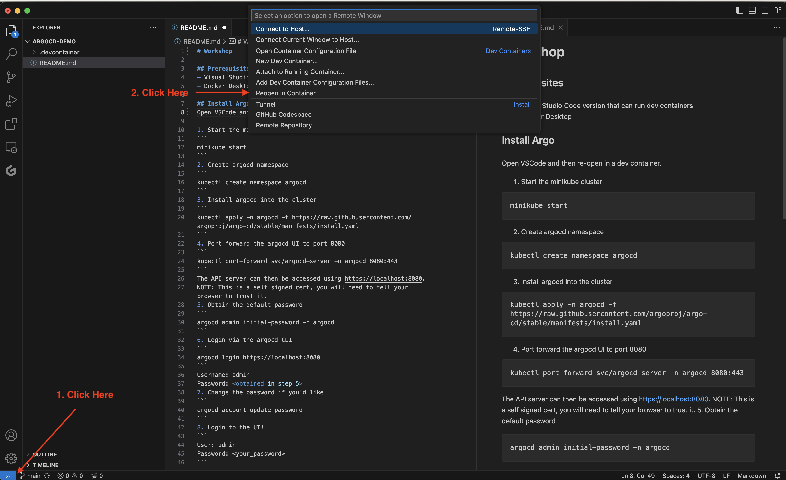

## Start Backstage

### Stand Up Database
Run the following command in a terminal:
```sh
docker compose up
```

### Start Backstage
Open another terminal if needed and run the following commands:
```sh
yarn dev
```

### Explore Backstage
Backstage will open on http://localhost:3000. You can explore the different components of backstage.

#### Home
In this view you can view the different `entity types` available by default in Backstage. You can even add your own if you'd like. By default Backstage comes with:
- Component
- Group
- Location
- System
- Template
- User

This repo will be mostly empty except for the default `Node.js` template. We will add other entities throughout the workshop.

#### APIs
There won't be anything here yet.

#### Docs
There won't be anything here yet but we will add Docs later.

#### Create
Here you will see the example Node.JS template. We will use this later in the workshop.

## Add Entities

We will be leveraging the following [gcp-microservices-demo](https://github.com/dillon-courts/gcp-microservices-demo) to explore the software catalog concept and add entities.

### Add a System
Navigate to the `Create` section and client on `Register Existing Component`.

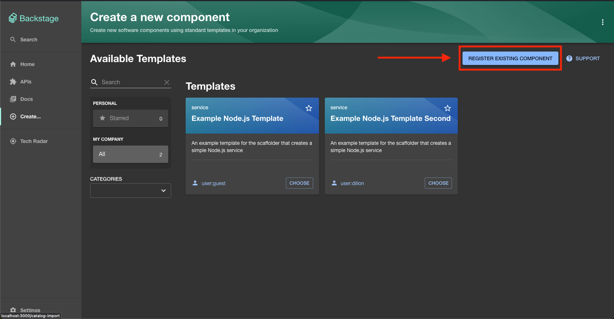

Enter the url of the catalog-info.yml file
```
https://github.com/dillon-courts/gcp-microservices-demo/blob/main/catalog-info.yaml
```

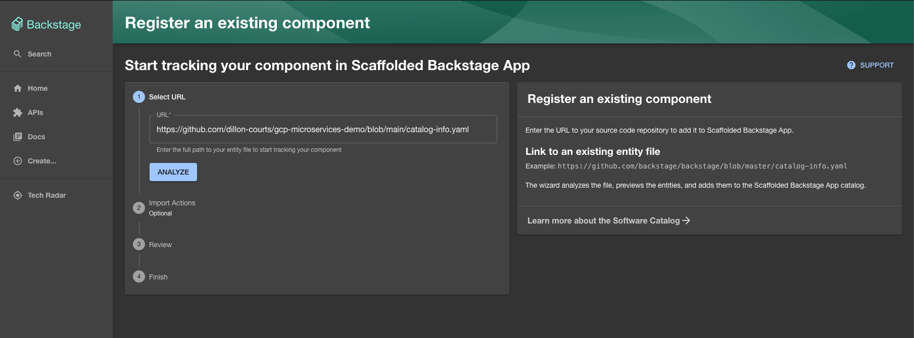

Click `Analyze` and then click through the next steps to import and add the component. You should now be able to view the entity under the `System` Kind on the Home page.

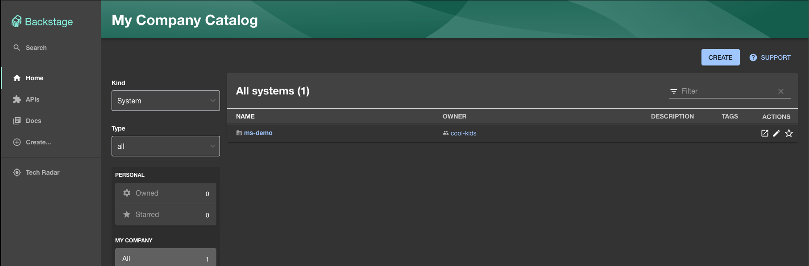

### Add several components of the system

Use the same process as above to add additional components of the system.

Add at least the following components so you can see how they fit together. You can add additional components if you'd like, each service within the [src directory](https://github.com/dillon-courts/gcp-microservices-demo/tree/main/src) contains a `catalog-info.yaml` file.

- https://github.com/dillon-courts/gcp-microservices-demo/blob/main/src/adservice/catalog-info.yaml
- https://github.com/dillon-courts/gcp-microservices-demo/blob/main/src/cartservice/catalog-info.yaml
- https://github.com/dillon-courts/gcp-microservices-demo/blob/main/src/checkoutservice/catalog-info.yaml
- https://github.com/dillon-courts/gcp-microservices-demo/blob/main/src/frontend/catalog-info.yaml

1. Go to the create section
2. Click `Register Existing Component`
3. Enter the URL of a catalog-info.yml file
4. Click `Analyze` and then `Import`

Once complete you should see all components registered on the Home page as Kind `Component`.

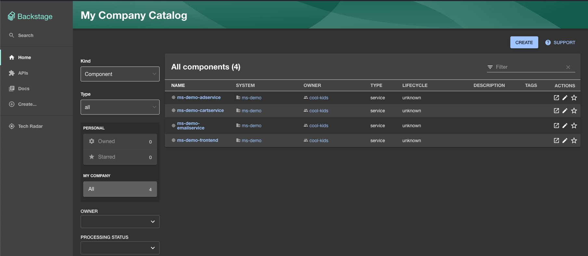

If you go view your `ms-demo` system you will see the connections have been generated in a graph like structure.

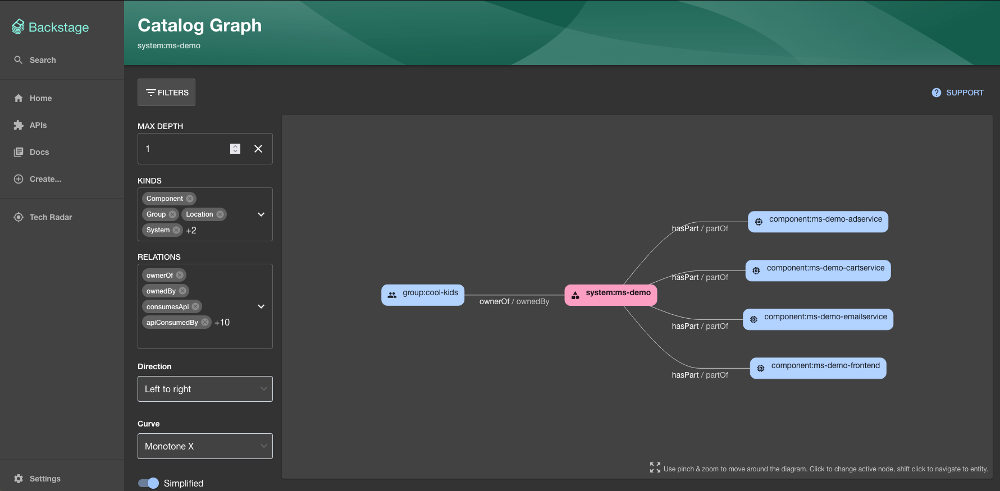

## Tech Docs

You can explore the Docs of any of the entities that have been added. The docs component reads any documentation in markdown format that is present inside a `docs` directory and displays it within the Backstage portal.

## Scaffolding a service

Scaffolding a service allows the creation of a new repository based on a template. You can use this to allow self service of new repository creation with your organization standards.

There are two steps to this process.

### Add a Github Personal Access Token

You need to create a Github Personal Access Token to give Backstage permissions to create a new repository within your account.

1. Navigate to Developer Settings on your Github Account. Profile -> Settings -> Developer Settings -> Tokens Classic -> Generate Token -> Generate New Token (Classic).

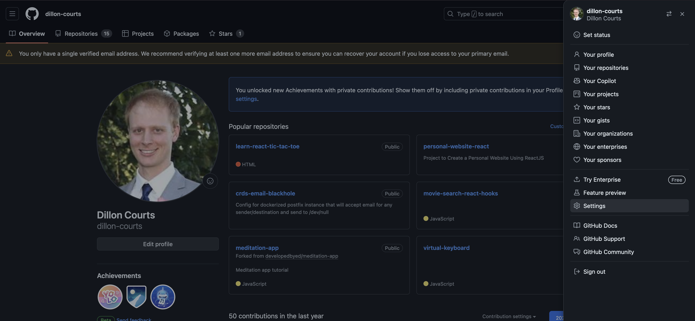

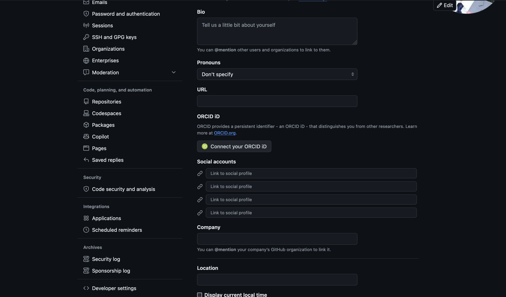

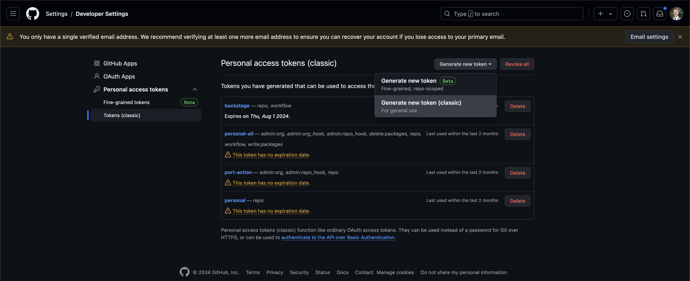

2. Select the `repo` & `workflow` permissions and generate the token.

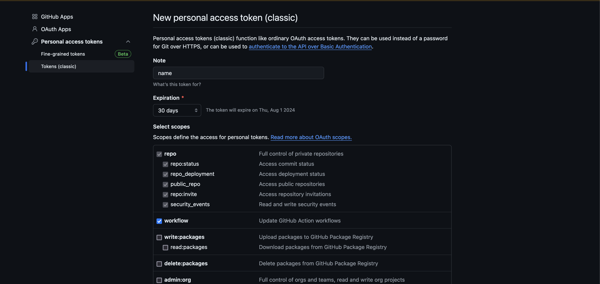

3. Copy the generated token and paste it into your Backstage `app-config.yaml` file in the integrations section.

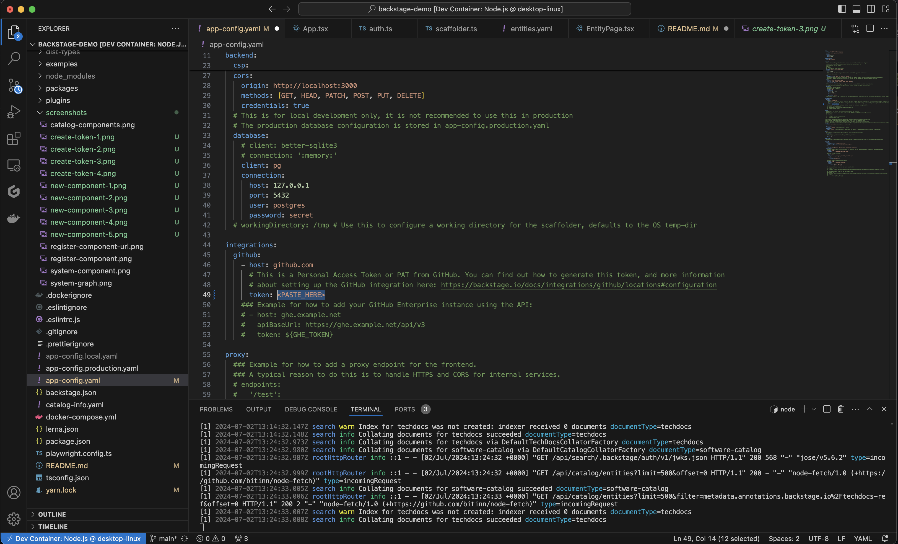

4. Restart Backstage 
- `(ctrl+c)`
- `yarn dev`

### Create a new Repository

1. Navigate to the `Create` page and add click the `Choose` button on the NodeJS template.

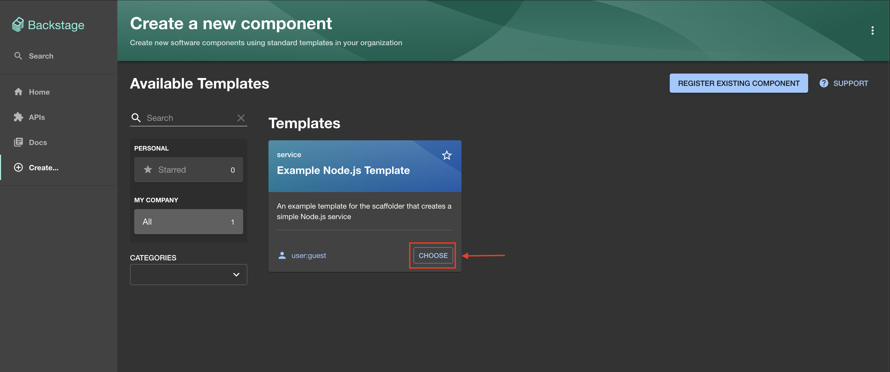

2. Enter a name for your component. This is the name that will be used in the `catalog-info.yml` file, so it will be the same name shown in backstage. Click `Next`.

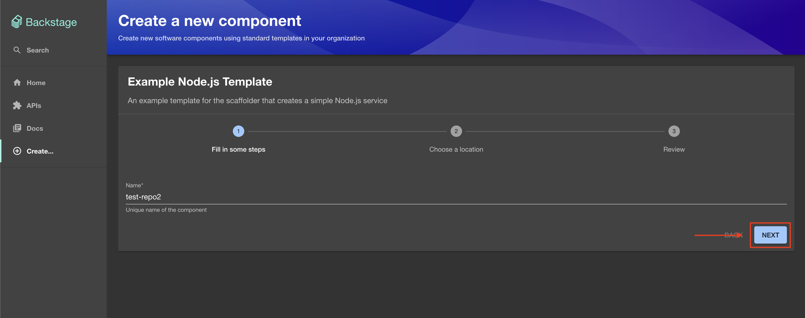

3. Enter the `owner` as your github username and enter a name for the repository. Click `Review`.

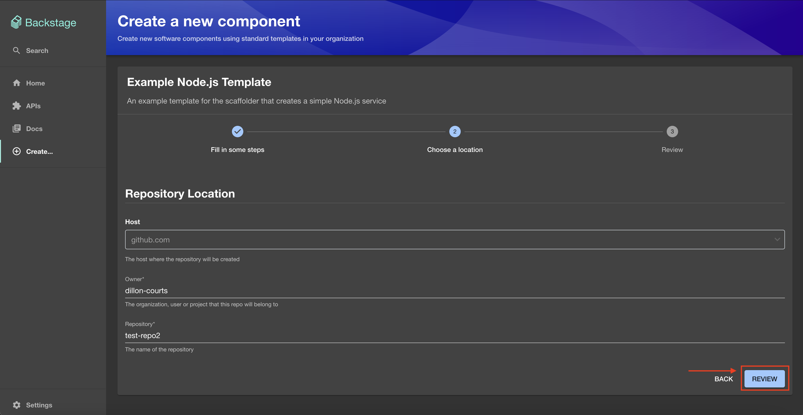

4. Click `Create`.

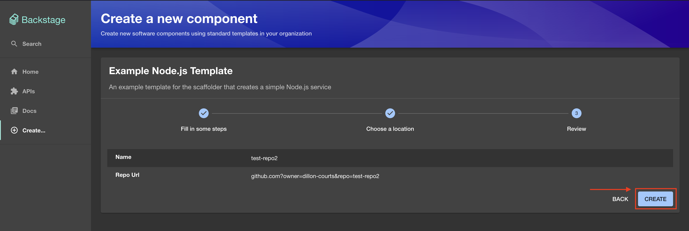

5. Your repository should be created, you can view it either in github or backstage by using the links provided.

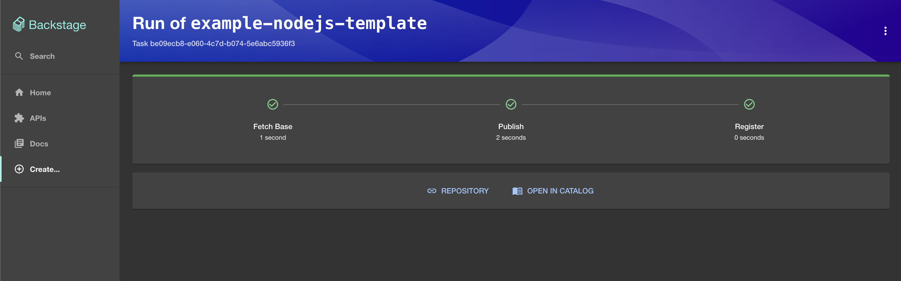

## Install the Tech Radar Plugin

We are going to add a single plugin to see what that process entails. The Tech Radar plugin was chosen for simplicity.

1. Add the package.

From your Backstage root directory
```
yarn --cwd packages/app add @backstage-community/plugin-tech-radar
```

2. Modify your app routes to include the Router component exported from the tech radar, for example:

```
// In packages/app/src/App.tsx
import { TechRadarPage } from '@backstage-community/plugin-tech-radar';

const routes = (
  <FlatRoutes>
    {/* ...other routes */}
    <Route
      path="/tech-radar"
      element={<TechRadarPage width={1500} height={800} />}
    />
```

3. Add a link to the side bar:
```
// In packages/app/src/components/Root/Root.tsx
        {/* End global nav */}
        <SidebarDivider />
        <SidebarScrollWrapper>
          {
            <SidebarItem icon={CreateComponentIcon} to="tech-radar" text="Tech Radar" />
          /* Items in this group will be scrollable if they run out of space */
          }
        </SidebarScrollWrapper>
      </SidebarGroup>
```
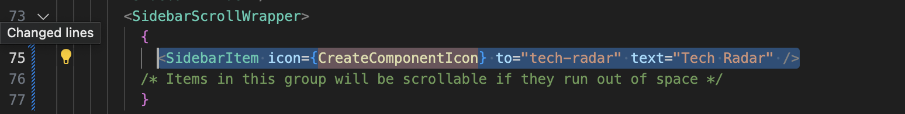

3. Restart the app with `(ctrl+c)` followed by `yarn dev` and either click the new link in the side bar or navigate directly to http://localhost:3000/tech-radar
